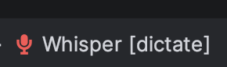
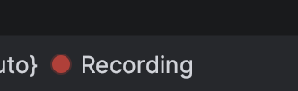
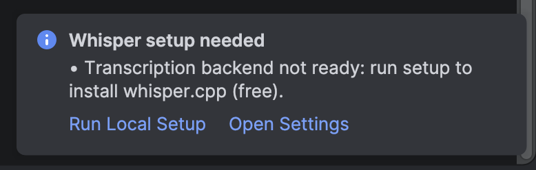
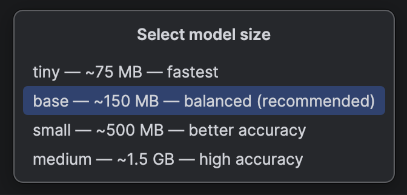
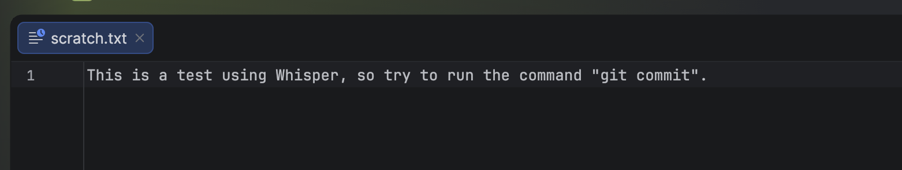

# Whisper - Speech to Text for JetBrains IDEs

Voice-to-text dictation for IntelliJ-based IDEs powered by [OpenAI Whisper](https://openai.com/research/whisper).
Speak instead of type - anywhere a caret is focused.

<p align="center">
  
  &nbsp;&nbsp;&nbsp;
  
</p>

---

## Features

- **Three transcription backends**
  - **Local** - [whisper.cpp](https://github.com/ggerganov/whisper.cpp), fully offline, free.
  - **OpenAI** - Whisper API.
  - **Groq** - Whisper Large V3, fastest cloud option.
- **Three dictation modes**
  - **Dictate** - raw transcription inserted as-is.
  - **Code** - spoken punctuation mapped to symbols (`open paren` -> `(`, `equals` -> `=`, etc.), filler words removed, casing fixed for code context.
  - **Command** - formatted as a clean coding instruction, ideal for AI chat panels.
- **Inserts anywhere** - direct caret insertion in the editor; clipboard-paste fallback for tool windows, terminal, and external apps.
- **Multilingual** - every language Whisper supports (`en`, `fr`, `de`, `es`, `it`, `pt`, `ja`, `zh`, …).
- **Privacy by default** - Local backend keeps audio on-device. Nothing leaves your machine unless you opt in to a cloud backend.

---

## Requirements

- IntelliJ-based IDE 2024.2 or newer (IntelliJ IDEA, PyCharm, WebStorm, GoLand, RustRover, …)
- An audio capture tool: [`sox`](https://sox.sourceforge.net/) **or** [`ffmpeg`](https://ffmpeg.org/)
- For the **Local** backend (recommended): `git`, `cmake`, a C/C++ compiler

| Platform | Install audio tool |
|---|---|
| macOS | `brew install sox` (or `brew install ffmpeg`) |
| Linux | `apt install sox` (or `apt install ffmpeg`) |
| Windows | [Download ffmpeg](https://ffmpeg.org/download.html) and add to `PATH` |

---

## Installation

1. **From JetBrains Marketplace:** Settings -> Plugins -> Marketplace -> search **"Whisper Speech to Text"** -> Install.
2. **From disk:** download the latest `.zip` from [Releases](https://github.com/roussi/whisper/releases), then Settings -> Plugins -> ⚙ -> Install Plugin from Disk.

---

## Quick start

### 1. Install an audio tool

Whisper records audio via `sox` or `ffmpeg`. Install one - see [Requirements](#requirements).

### 2. First launch - automatic setup prompt

When you open a project, the plugin detects missing setup and shows a notification:

<p align="center">
  
</p>

- **Run Local Setup** - installs whisper.cpp + a model (free, offline, recommended).
- **Open Settings** - configure an OpenAI or Groq API key instead.

If you dismiss the prompt, you can re-trigger it anytime: press **Shift twice** (Search Everywhere) and run **Whisper: Show Setup Guide**.

### 3. Pick a model

Choose the size that matches your hardware and accuracy needs:

<p align="center">
  
</p>

| Model | Size | Use case |
|---|---|---|
| `tiny` | ~75 MB | Fastest, short dictation |
| `base` | ~150 MB | Balanced - recommended |
| `small` | ~500 MB | Better accuracy |
| `medium` | ~1.5 GB | High accuracy, slower |

The plugin clones [whisper.cpp](https://github.com/ggerganov/whisper.cpp), compiles it locally, and downloads the chosen model.

<p align="center">
  
</p>

When complete:

<p align="center">
  
</p>

### 4. Dictate

Press **`⌘M`** (macOS) or **`Ctrl+M`** (Windows / Linux) to start recording. Press again to stop and transcribe.

| State | Status bar |
|---|---|
| Idle |  |
| Recording |  |

The transcription is inserted at your caret:

<p align="center">
  
</p>

---

## Configuration

**Settings -> Tools -> Whisper**

| Setting | Description |
|---|---|
| Backend | `Local`, `OpenAI`, or `Groq` |
| Mode | `Dictate`, `Code`, or `Command` |
| Recording tool | `Auto`, `sox`, or `ffmpeg` |
| OpenAI API key | Required for OpenAI backend |
| Groq API key | Required for Groq backend |
| Local whisper path | Optional: custom binary path (otherwise uses bundled whisper.cpp) |
| Local whisper model | `tiny` / `base` / `small` / `medium` |
| Language | ISO code (`en`, `fr`, `de`, …) |
| Show notifications | Toggle setup/info notifications |

You can switch mode/backend on the fly. Press **Shift twice** (Search Everywhere) and run:
- **Whisper: Set Dictation Mode**
- **Whisper: Select Transcription Backend**

---

## Dictation modes in detail

### Dictate
Raw transcription. What you say is what gets inserted.

> *"Hello world, this is a test."* -> `Hello world, this is a test.`

### Code
Strips fillers, maps spoken punctuation to symbols, normalizes keyword casing.

> *"const user equals open paren id comma name close paren"* -> `const user = (id, name)`

Supported spoken tokens: `open paren`, `close paren`, `open bracket`, `close brace`, `comma`, `period`, `semicolon`, `equals`, `double equals`, `triple equals`, `not equals`, `arrow`, `fat arrow`, `plus`, `dash`, `pipe`, `ampersand`, `dollar sign`, `hash`, `at sign`, `underscore`, `new line`, …

### Command
Formats speech as a clean instruction - ideal for AI chat (Junie, Copilot, Cursor, etc.).

> *"so um make this function async and add error handling"* -> `Make this function async and add error handling.`

---

## macOS: paste permissions

If you dictate into the **editor**, the plugin inserts directly at the caret - no permissions needed.

For **other targets** (terminal, search field, external apps), the plugin uses clipboard + simulated `⌘V`. macOS requires Accessibility access:

**System Settings -> Privacy & Security -> Accessibility -> enable your IDE.**

If permission is denied, the plugin still copies the text to the clipboard and shows a notification - press `⌘V` manually.

---

## Privacy

- **Local backend:** audio never leaves your machine. whisper.cpp runs in-process.
- **OpenAI / Groq:** audio is uploaded to the respective API endpoints over HTTPS. See their privacy policies.
- The plugin does not collect telemetry.

---

## Troubleshooting

| Problem | Fix |
|---|---|
| `No recording tool found` | Install `sox` or `ffmpeg` (see [Requirements](#requirements)) |
| Plugin works in terminal but not editor | Editor caret insertion is automatic - no setup needed. Try clicking inside the editor first. |
| Paste doesn't work in external apps | Grant Accessibility access to your IDE in macOS System Settings |
| Local transcription returns gibberish | Try a larger model (`small` or `medium`) or set the correct `Language` in settings |
| Setup hangs at "Compiling whisper.cpp" | Check the IDE log (`Help -> Show Log in Finder`) for compiler errors |
| Recording fails immediately | Check microphone access for your IDE in System Settings -> Privacy -> Microphone |

Need help? Open an [issue](https://github.com/roussi/whisper/issues).

---

## Building from source

```bash
git clone https://github.com/roussi/whisper.git
cd whisper
./gradlew buildPlugin           # outputs build/distributions/whisper-<version>.zip
./gradlew runIde                # launches a sandbox IDE with the plugin
./gradlew verifyPlugin          # runs the JetBrains Plugin Verifier
```

Requires JDK 21.

---

## Credits

- [OpenAI Whisper](https://openai.com/research/whisper) - the underlying speech recognition model.
- [whisper.cpp](https://github.com/ggerganov/whisper.cpp) - high-performance C/C++ port that powers the Local backend.
- Inspired by [superwhisper](https://superwhisper.com).

---

## License

[Apache License 2.0](LICENSE) © Abdelghani Roussi
